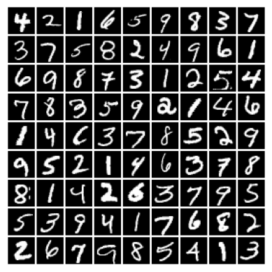
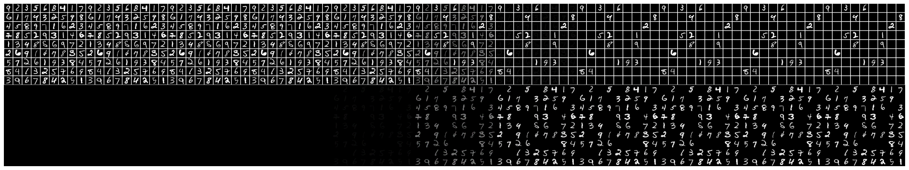

## Application of Blackout (Discrete) Diffusion to Sudoku solving

Based on the paper https://arxiv.org/abs/2305.11089

Dataset was obtained from https://github.com/rasmusbergpalm/recurrent-relational-networks

We use MNIST to construct the image, a sample pair (17 known - solution) is

Following the same idea in the Blackout paper, the forward process and rate are constructed from the binomial corruption process:
